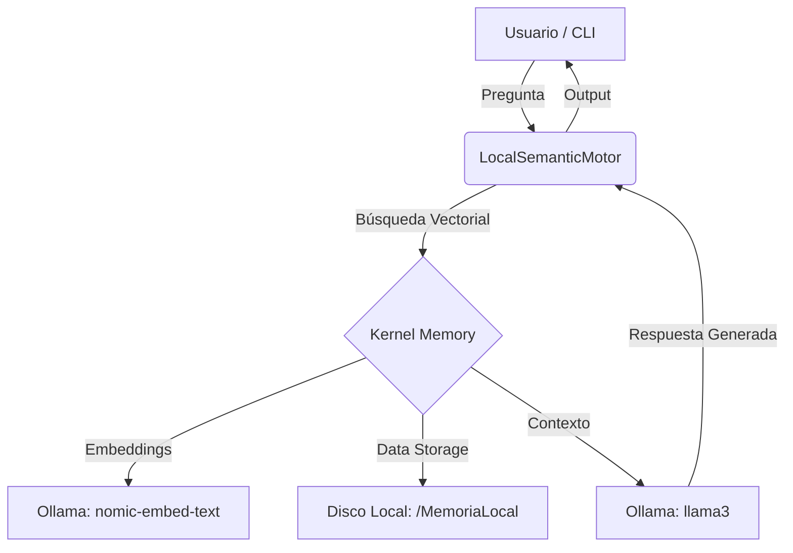

# Advanced Semantic Search CLI

Una herramienta de línea de comandos potente y minimalista para realizar **búsquedas semánticas locales** utilizando **Microsoft Kernel Memory** y **Ollama**. Este proyecto permite ingerir documentos (PDF, TXT) y realizar preguntas en lenguaje natural sobre ellos sin depender de la nube.

---

## Arquitectura y Flujo de Datos

El sistema sigue una arquitectura atómica donde el "Cerebro" (LLM) y la "Memoria" (Vector DB) están desacoplados.



---

## Requisitos Previos

1.  **[.NET 10 SDK](https://dotnet.microsoft.com/download/dotnet/8.0)** instalado.
2.  **[Ollama](https://ollama.com/)** en ejecución local.
3.  Modelos descargados en Ollama:
    ```bash
    ollama pull llama3
    ollama pull nomic-embed-text
    ```

---

## Configuración

Asegúrate de editar el archivo `appsettings.json` con la configuración de tus modelos:

```json
{
  "Ollama": {
    "Url": "http://localhost:11434",
    "TextModel": "llama3",
    "EmbeddingModel": "nomic-embed-text"
  },
  "Storage": {
    "Directory": "MemoriaLocal"
  }
}
```

---

## Guía de Uso

### 1. Ingesta de Documentos

Puedes ingerir archivos individuales o carpetas completas. El sistema asignará etiquetas automáticamente.

```bash
# Ingerir un PDF específico
dotnet run ingest "C:\Documentos\Manual.pdf"

# Ingerir una carpeta completa (Recursivo)
dotnet run ingest-folder "C:\Documentos\Proyectos"
```

### 2. Realizar Consultas

Pregunta lo que quieras sobre tus documentos. Puedes filtrar por etiquetas (Tags).

```bash
# Consulta general
dotnet run ask "¿Cuál es la política de vacaciones?" "español"

# Consulta con filtro por departamento
dotnet run ask "¿Cómo configurar el VPN?" "español" "department:IT"
```

### 3. Mantenimiento

```bash
# Eliminar un documento de la memoria
dotnet run delete "Manual.pdf"
```

---

## Estructura del Proyecto

- **`Interfaces/`**: Definiciones de contratos para desacoplamiento.
- **`LocalSemanticMotor.cs`**: Implementación principal del motor semántico (Kernel Memory).
- **`Program.cs`**: Orquestador de la CLI y manejo de argumentos.
- **`MemoriaLocal/`**: Directorio donde residen los vectores y fragmentos (No subir al repo).

---

## Global Query Filter (Tenant Isolation)

El motor está preparado para soportar `TenantId` a través de **Global Query Filters**, permitiendo segmentar la memoria por usuario o entorno de forma transparente.

---

> [!TIP]
> Para obtener mejores resultados, utiliza documentos bien estructurados. El modelo `nomic-embed-text` es excelente para capturar el contexto semántico en español.
