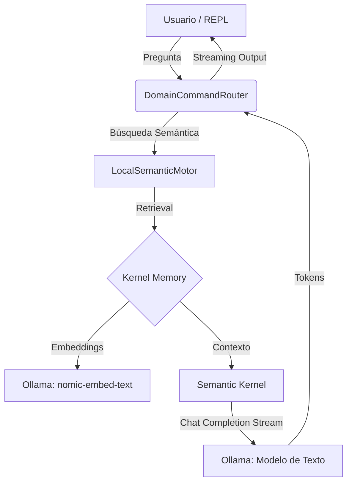

# Advanced Semantic Search CLI

[](https://github.com/Valen23/advanced-semantic-search-cli/actions/workflows/verify.yml)

Una herramienta de línea de comandos profesional diseñada para la gestión y consulta semántica de documentos locales. Utiliza una arquitectura avanzada basada en Microsoft Kernel Memory y Semantic Kernel, integrada con Ollama para garantizar privacidad total y procesamiento local sin necesidad de conexión a internet para su uso.

> [!IMPORTANT]
> IMPORTANTE: LEER TODA LA DOCUMENTACIÓN PARA EL MEJOR USO POSIBLE DE LA HERRAMIENTA

---

## Características Principales

- **Streaming Semántico**: Generación de respuestas en tiempo real (token por token) utilizando Semantic Kernel.
- **Sistema de Temas Dinámicos**: Biblioteca de temas visuales integrada (Gotham, Rust, Neon-Vapor, Forest, Glacier) con persistencia automática.
- **Arquitectura Desacoplada**: Separación estricta entre el motor semántico, el enrutador de comandos y el entorno de ejecución interactivo.
- **Gestión de Sesión**: Soporte para filtros globales, cambio de idioma al vuelo y preservación de historial de comandos.

---

## Arquitectura y Flujo de Datos

El sistema utiliza Microsoft Kernel Memory para la orquestación de RAG (Retrieval-Augmented Generation) y Semantic Kernel para el streaming de chat completion.



---

## Requisitos Previos

1.  **[.NET 10 SDK](https://dotnet.microsoft.com/es-es/download/dotnet/10.0)** instalado.
2.  **[Ollama](https://ollama.com/)** en ejecución local.
3.  Modelos recomendados en Ollama:
    ```bash
    ollama pull llama3
    ollama pull nomic-embed-text
    ```

---

## Configuración

El archivo `appsettings.json` permite configurar el comportamiento del motor y la estética de la interfaz. Los cambios de tema realizados en la CLI se persisten automáticamente en este archivo.

```json
{
  "SemanticEngine": {
    "StorageDirectory": "MemoriaLocal",
    "OllamaEndpoint": "http://localhost:11434",
    "TextModel": "llama3",
    "EmbeddingModel": "nomic-embed-text",
    "Theme": "Gotham"
  }
}
```

---

## Guía de Uso

### 1. Inicio de la Aplicación

Para iniciar la herramienta:

```bash
dotnet run
```

### 2. Comandos de Dominio (Gestión de Conocimiento)

Estos comandos gestionan la base de datos de vectores.

- `ingest "<ruta>"`: Ingiere un archivo individual (PDF, TXT).
- `ingest-folder "<ruta>"`: Ingiere recursivamente todos los documentos compatibles de una carpeta.
- `ask "<pregunta>"`: Realiza una consulta semántica con respuesta en streaming y visualización de fuentes.
- `delete "<id>"`: Elimina un documento y sus vectores asociados de la memoria local.

### 3. Comandos de Sesión y Entorno

- `set-lang "<idioma>"`: Cambia el idioma en el que el modelo redacta las respuestas.
- `set-filter "<clave:valor>"`: Aplica un filtro global para restringir las búsquedas (ej: `category:docs`).
- `set-theme "<nombre>"`: Cambia instantáneamente la paleta de colores (Gotham, Rust, Neon-Vapor, Forest, Glacier).
- `clear` / `cls`: Limpia la consola y restablece el banner visual.
- `help`: Muestra la lista detallada de comandos.
- `exit` / `quit`: Finaliza la sesión.

---

## Estructura del Proyecto

- **`Interfaces/`**: Contratos para el motor semántico y modelos de datos de streaming.
- **`UI/`**: Sistema de temas, constantes de colores ANSI y biblioteca de estilos.
- **`Routing/`**: Enrutador de comandos que gestiona la lógica de presentación y el procesamiento de resultados.
- **`Repl/`**: Entorno de ejecución interactivo que gestiona el bucle de usuario y el estado de la sesión.
- **`LocalSemanticMotor.cs`**: Núcleo RAG basado en Microsoft Kernel Memory.
- **`MemoriaLocal/`**: Directorio de persistencia de vectores y fragmentos (ignorado por Git).

---

## Desarrollo y Contribución

Este proyecto sigue un flujo de trabajo profesional para garantizar la estabilidad y el versionamiento automático.

### 1. Convencionalismo de Commits

Para mantener un historial claro y permitir la automatización, se recomienda seguir el estándar de [Conventional Commits](https://www.conventionalcommits.org/):

- `feat:` Nuevas funcionalidades (ej: `feat: streaming de respuesta`).
- `fix:` Corrección de errores.
- `refactor:` Cambios que no añaden funcionalidades ni arreglan bugs.
- `chore:` Tareas de mantenimiento o configuración.

### 2. Versionamiento Automático

Las versiones se calculan automáticamente basándose en los **Git Tags** utilizando MinVer.

- Para crear una nueva versión, simplemente añade un tag y súbelo:
  ```bash
  git tag v1.0.0
  git push origin v1.0.0
  ```

### 3. CI/CD

- **Verificación**: Cada Pull Request o Push a `main` activa una compilación automática para validar la integridad del código.
- **Release**: Al subir un tag `v*`, GitHub Actions generará automáticamente una nueva "Release" con binarios compilados para Windows y Linux.

---

> [!TIP]
> Para obtener la mejor precisión, se recomienda organizar los documentos en carpetas temáticas; el sistema utilizará los nombres de las carpetas como etiquetas automáticas para facilitar el filtrado posterior.
